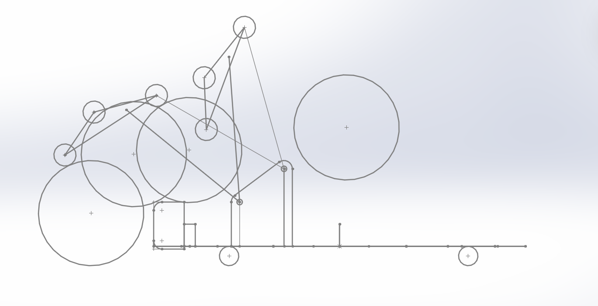
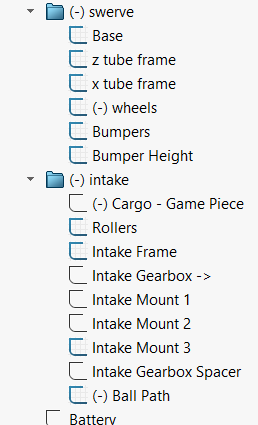
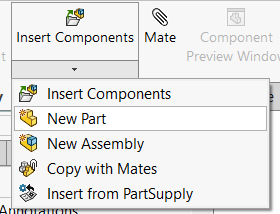
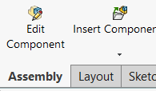

# Layout Sketching

Layout sketching is when you create a sketch that models your robot and that you can build parts off of. 

## Why is layout sketching important?

It is important to create dependencies and to ensure that your robot fits the rules and restrictions of the game and aligns with how you want your robot to be. 

This is an example of a layout-sketched 4 bar intake.

As you can see, I sketched the rollers and the balls to ensure that the intake can make adequate contact with the balls to pull them into the robot. I also sketched the up position of the intake to make sure the intake will fit properly when it's up so that our robot doesn’t get disqualified. I also sketched a plate to mount it to the chassis.

I used this layout sketch to model the actual parts I used when constructing the intake. Whenever I edit my layout sketch, the actual intake changes with it. If I want to change the height of the intake, I can change those dimensions and the mount will become higher.

Thus, layout sketches are important to easily modify your robot in case you need to make changes, or in case you want to cad a template elevator or intake for use in a bunch of other robots. They are also important for checking to make sure your subassembly isn’t majorly flawed before putting it into the robot.

## How to layout sketch

A layout sketch is literally just a part. Open a part in an assembly file(this is important for later) and start sketching on whatever plane makes sense. Create a bunch of sketches that represent different parts or subsystems in your robot and you’re chilling. Don’t be afraid to create a bunch of sketches, but make sure to organize them in folders and give them names to ensure that other people looking at your CAD can understand it since layout sketches can get messy.

Typically, you want your layout sketches to be pretty simple and only contain the information that you need. The intake’s layout sketch is very bare bones and only contains the information necessary to build the side plates, guide the proper direction of the bars, and create a proper mount that attaches to the bars. You don’t need to layout sketch everything like extrusions. 

If you’re worried that you don’t have enough detail or have too much detail, just make the part and add/get rid of stuff to fit the part.

## How to make parts from layout sketches

Since you made your layout sketch in an assembly, you can create parts out of it there. Then, when you want to create a new part based off of the layout sketch, click the arrow under insert components and create a new part in the assembly. Then, once you’ve made and named the part, make sure to click the edit component button to create your dependencies in the part and not the assembly. 

There are three nice ways to create dependencies in a part from a layout sketch.

### Convert Entities

The first way you can create dependencies is by converting entities. By creating a sketch on the desired plane and converting whatever entities you want from the layout sketch, you get a direct dependency. This is nice for holes and places where you might need to fill in the gaps with some tangent lines or something. Never use this when you can convert the entire sketch tho, only use it when you have to fill in some gaps because you can just use method number 3 to convert entire sketches..

### Offset Entities

This is nice for when your layout sketch has holes sketched and you want to have a specific amount of clearance. This also creates a dependency.

### Derived Sketches
Derived sketches are also really nice and probably the type of dependency I use the most. It’s used whenever you want to map a whole sketch over to the part. You simply select the sketch and the plane in the part that you want to map it onto, then right click and derive it. This replicates the original sketch that was part of the layout stuff with complete dependency ready for extrusion.

## How to save your parts

Once you’ve finished your layout sketch and made some parts out of it, save the assembly. When you are saving the assembly, it will ask you if you want to save it with or without in context references. Choose without. Then, it’ll ask you if you want to save the parts internally or externally. Internal saving basically means all the information of the parts are saved under the assembly, and external means all the information of parts are saved in their own parts files and are referenced in the assembly. Choose external because it saves parts separately allowing for easy bottom up designing.

## How to use the parts you made in the layout sketch

Once you’ve saved the parts, open them in a new assembly and do the mates. If you want, put the layout sketch in there too. I prefer creating two different assemblies when layout sketching, one to make the parts, and one to actually put the parts together and make the robot. I found that when I was using only one assembly, relations would get really weird and buggy when I moved parts around, so I keep parts in my part-construction assembly in the same spot since there’s no reason to move them if I’m not mating and stuff. 