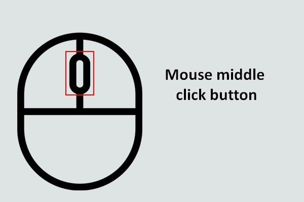
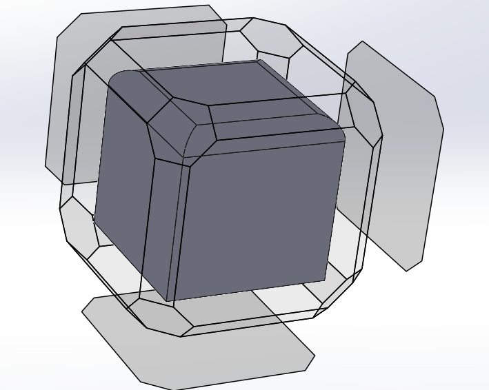
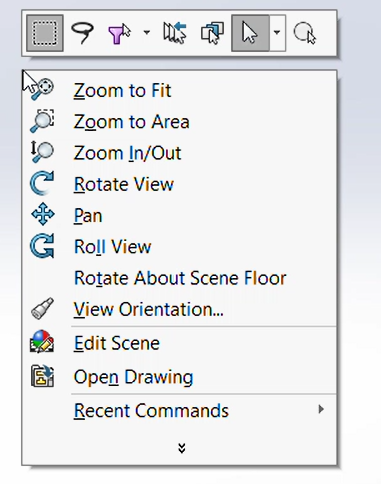
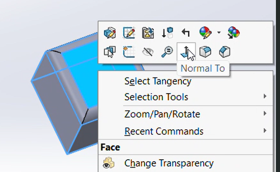

# Controls

Navigating and controlling the Solidworks environment can be difficult, so we provide a tutorial on how to easily navigate the SolidWorks environment. 

To make navigation easier, it is recommended that you use a mouse. 

## Rotation

There are three main ways to rotate.

The first way is by clicking your mouse's middle button and dragging. This rotates in whatever way you drag. To restrict this movement, you can click alt + middle button to restrict rotation to only a clockwise or counterclockwise motion.  

To change the angle from which you view the part studio, you can click ctrl + any number from 1 - 7 and it will switch the way you look at the environment. 

For a more detailed choice of POV, you can click ctrl + space, which will project the shape in the image below, of which you can select a side that becomes your new POV. 

## Panning

To pan, or move your shape across the screen, you can zoom in and zoom out in different spots to move your part, or you can click ctrl + middle button allowing you to directly pan. 

## Zoom

To zoom in or out, simply use your mouse's scroll wheel. For more advanced options, you can right click on open space that gives you a menu of zoom options. If you right click on an entity, you can choose the normal to option which allows you to face the selected entity directly. You can also select an entity and do ctrl + 8 for normal to. 

   