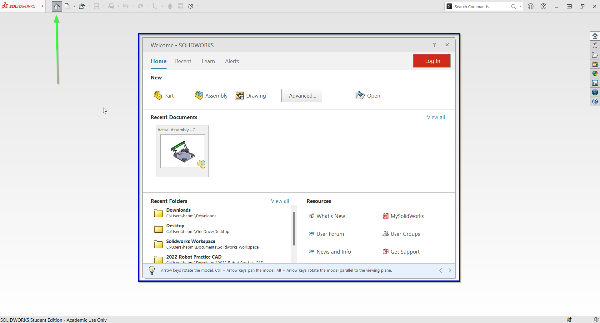

# Basic Solidworks Navigation

## Welcome Dialouge (Home)
The Welcome Dialouge (We call it Home) is the screen you see when you open the Solidworks app. It allows you to create parts/assemblies/drawings, open recent documents, and even has a learning tab (Highly recomend this). The blue box shows what the home menue looks like. If it doesn't show up for you, it can be toggled by pressing the home icon (blue arrow) or by the shortcut `Ctrl + F2`

## Options (Settings)
The options dialouge allows you to access Solidworks's general settings. A lot of them aren't important to FRC, but some are. You can access it by clicking the gear setting icon (Blue Arrow). Access the add-ins menu from the mini arrow (Red Arrow)

.png)

### System Settings
System settings is like the "General Solidworks Settings". The most important settings are for performance, locations, templates, and 

### Document Setttings

## Task Pane
This side pannel gives access to many useful Solidworks resources, and access to 3rd party extensions. You can access it by clicking on the side icons (Blue Arrow). Each icon is a "tab" (Like the house icon = Solidworks Resouces)

### Showing More Tabs

### McMaster-Carr Plugin

### Design Library

### File Explorer & Solidworks PDM

### Apearences

### 3DExperience

