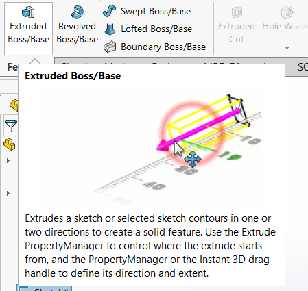
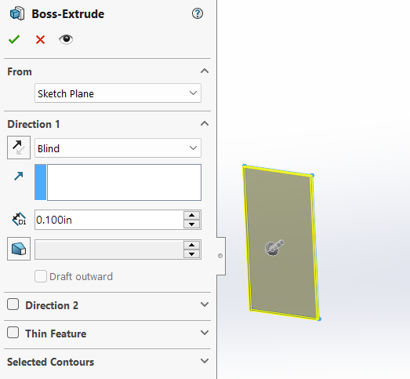
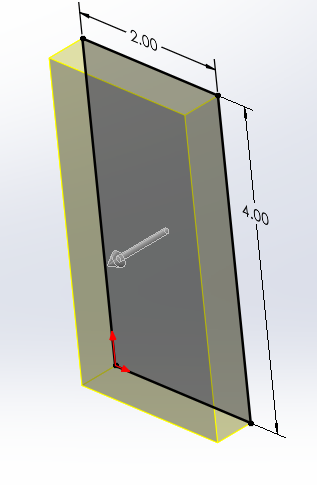
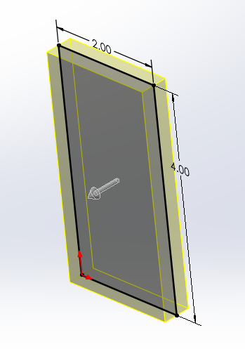
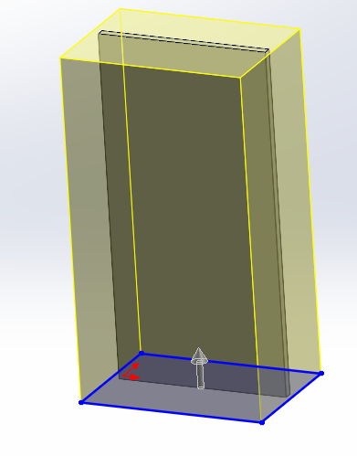
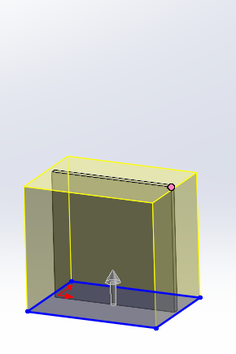
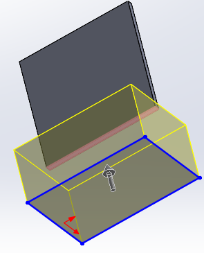
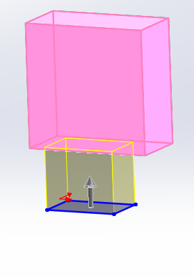
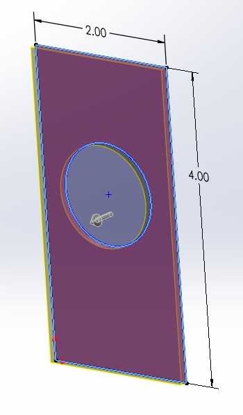

# 3D Modeling

Now that you have made your sketch, you need to make the part 3 dimensional for real world use. To do this, you can use a variety of methods to give your sketch depth and features. 

## Extrusions

Extrusions are how you give your 2D sketch depth along a constant axis. To extrude, simply select a sketch and then click extrude.

Once you click extrude, a side menu pops up along with a preview of how your extrusion looks like. 

The from menu contains some options that you can use to define where you want your extrusion to start from. The option sketch plane simple extrudes the sketch from the plane it was drawn on. From a surface, face, or plane allows you to begin the extrusion from a plane that is facing the same direction as the initial sketch. The same applies when extruding from a vertex. When extruding from an offset, it is just like extruding from the sketch plane except it is offset in a specific direction by a distance of your choice. Changing where you extrude from pretty much just offsets the extrusion from the sketch itself. 

Next, you can define how much you extrude by. 

| Blind | Mid Plane | Through All | Up To Vertex | Up to Surface | Up to Body |
| -------- | ------- | ------- | ------- | ------- | ------- |
| The option blind allows you to specify the amount you extrude by, and is the simplest way to extrude.  | Next is mid plane, which is just like blind except the extrusion goes outwards both ways from the sketch instead of just extruding one way, making the sketch in the center of the extruded part.  | The option through all only works when there are other entites along the course of the extrusion. This allows you to extrude through all of the entities that are in the way of the extrusion.  | Up to vertex allows you to select a vertex, and the extrusion extrudes up until the vertex. | The same applies to up to surface, except instead it is a surface. | Up to body extrusions are similar, except the sketch that you are extruding needs to be completely enveloped by the body. Then, the sketch continues to extrude until it matches the body perfectly. |
 |    |  |  |  |  |  

You can also add a second direction to your extrusion if you want to extrude from the other side as well. There is also an option to add draft to your extrusions, which is pretty much a tool where you can make your extrusion progressively narrower and narrower in a slant typa way. You can also draft outwards, and make it wider and wider. There is also an option to select contours, which you can use when there are some overlapping shapes in your sketch. For example, if you extrude a rectangle with a circle drawn in it, you could select a rectangle and it would extrude the rectangle with a hole in it.

## Revolves

## Sweeps

## Lofts

## Cuts

## Patterns

## Fillets and Chamfers

## Rib, Shell, and Draft

## Hole Wizard

## Reference Geometry

