# Basic Sketching

Welcome to part construction! Here, you will learn how to model parts in a 2 dimensional sketch and then use a variety of methods to make them 3d dimensional. This first part focuses on the 2 dimensional sketching part. Here, you will learn how to create shapes, change dimensions of your part, and use other tools to make your creations more complex for your FRC use.

### Lines and Shapes

First, create a sketch by clicking the sketch button, then selecting your desired plane. You can then draw shapes and lines(AKA sketch entities) on this sketch. You can use the interface next to the right of the sketch button to choose what kind of shapes and lines you want to make. Typically, you start your sketch based off of the origin, because the origin is a constant stasis point that never changes, making your parts stable. 

**Commonly used sketch tools**

**Lines**

By clicking L or clicking the line option in the interface shown above, in the top left corner, you can create a line. Simply tap at the starting point, and tap at the ending point. If you click the arrow next to the line option, you get two more options.

Centerline is a line that is for construction. This just means that it isn't really part of the sketch, but instead it's just there for reference. You can put centerlines into your sketch to draw other shapes on it. For example, you can put a centerline that goes a specific angle from the origin and put a circle on it for alignment. 

The midpoint line means that the first spot where you click is the midpoint of your new line. As you move your cursor you create a line that goes both ways. 

**Circles**

With the classic circle, you can simply click the center and move your cursor out which sets the radius. For the perimeter circle, you select 3 points which define the perimeter of the circle. 

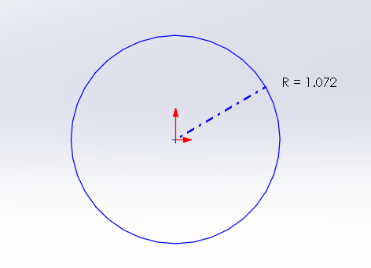

**Rectangles**

Out of all of the options, the first two are the most important. There is a corner rectangle, where you can select a corner of the rectangle and expand to make it larger. Then, there is the center rectangle, where you select the center of the rectangle and move your cursor outwards to make the diagonal longer. 

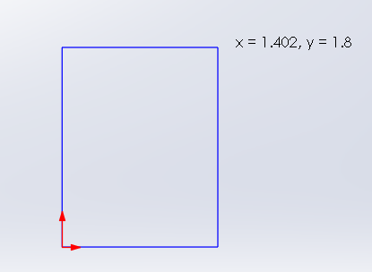

**Arcs**

The centerpoint arc is an arc where you select the center of a circle, then move your cursor outwards to select the radius of the circle, then move side to side to get arc length. Then, there is the tangent arc, in which you can create an arc along the ends of lines to connect them with an arc that is tangent to both of the lines. A little trick you can use for tangent arc is to hover over a lines endpoint, trace a line outwards and double back onto the endpoint allowing you to create a tangent arc. Then, there is the three point arg, where you select the starting point, end point, and a middle point of the arc. 

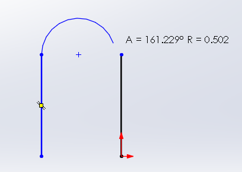

**Less common sketch tools**

**Splines**

You select a series of points, and a curvy line follows the points. These can be used when you need to connect a bunch of points  or when modeling cords or wiring in FRC(which is done very rarely).

**Ellipses**

For ellipses, you select center point, then drag out for the width, then drag out for the length. It is similar to creating a circle, except instead of radius, you need to specify both width and length. 

**Slots**

For slots, you draw the line, which is the middle of the slot and extend outwards to get the curvy part of the slot that gives it area. 

**Polygons**

For polygons, you denote a circle and the polygon is circumscribed in it. You can choose number of sides.

### Relations

Relations are ways to define how lines, points, curves, or shapes interact with each other or the environment around them. To add relations, you click on a sketch entity, then a sidebar pops up that includes a section that says add relations. To see relations, you can click the button that says 'view sketch relations' which is located under the eye dropdown. You can also select sketch entities, which will then make visible all sketch relations that the selected entity has. Sketch entities appear as small squares with a drawing denoting what kind of relation it is, as pictured below.

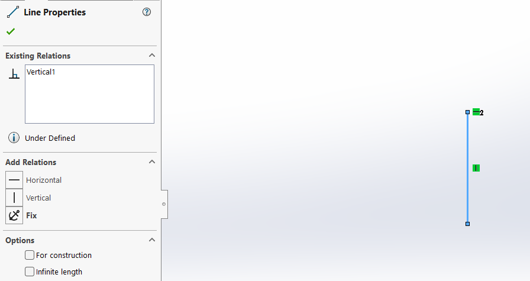

When you construct a sketch entity, oftentimes it automatically infers relations while you are sketching or dragging entities around. For example, if you drag the endpoint of a line onto another endpoint, SolidWorks will infer the coincident relation, meaning that both points are in the same spot. You can tell what relations are being inferred because it will pop up next to your cursor. 

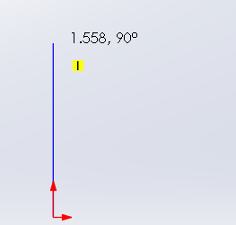

There are a lot of sketch relations, and oftentimes you may not use them all. Regardless, here is a table with sketch relations that you may come across. The relations that are bolded are most commonly used

| Relation | Entities to Select | Description |
| -------- | ------- | ------- |
| **Horizontal or Vertical** | Lines or points | When one line is selected, you can make that line vertical or horizontal. When two or more points or lines are selected, you can make them fall along the same imaginary horizontal or vertical line to each other. |
| **Collinear** | Two or more lines | The lines will fall on the same infinite line |
| Coradial | Two or more arcs | The items share the same center point and radius |
| **Perpendicular** | Two lines | The lines intersect at a 90 degree angle |
| **Parallel** | Two lines | The lines will never intersect |
| ParallelYZ | A line and a plane in a 3d sketch | Defines a line as parallel to a specific plane |
| Along | A line and a plane in a 3d sketch | Defines a line as normal to a specific face |
| **Tangent** | An arc, ellipse, or spline, and a line or arc | Makes the two entities touch |
| **Concentric** | Two or more arcs, or a point and an arc | Makes the arcs or points share the same center point |
| Midpoint| Two lines or a point and a line | A point remains at the midpoint of a line, or 2 lines share the same midpoint |
| Intersection | Two lines and one point | Two lines intersect at a specific point |
| **Coincident** | A point and a line, arc, or ellipse | The point lies on the other entity |
| **Equal** | Two of the same thing | They become equal |
| Symmetric | A centerline and two points, lines, arcs, or ellipses | The items remain equidistant from the centerline |
| **Fix** | Anything | Keeps the entity still and immovable |
| Pierce | A sketch point and an axis, edge, line, or spline | The sketch point is coincident to where the axis, edge, or curve pierces the sketch plane |
| Merge Points | Two points | The two points are merged into a single point |

### Dimensioning

Assigning dimensions is how you tell how big sketches are. To assign dimensions, use the smart dimension option and select what you want to dimension. The way you dimension something can be changed by what you click or the way you drag. Once you select the entity or entities where you want to create a dimension, simply click and enter the value you prefer. 

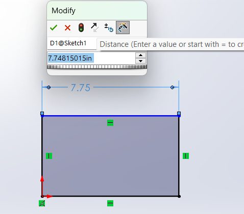

When you are dimensioning a sketch, you want to make sure that it is fully defined so things cannot move and your assemblies up later. To tell if something is defined, the color of the entity will change from blue to black, as shown in the picture above. Additionally, you can tell both next to the sketch's name and the bottom navigation bar whether or not the sketch is fully defined. Occasionally, you might overdefine your sketch. This means that two dimensions have been put in place that conflict and make the geometry impossible to exist, because the measurements you chose simply don't exist. To deal with this, simply undo your dimension with ctrl+z and choose a new dimension. 

You can dimension a wide variety of things. You can dimension length of a line by selecting that line, dimension the distance between two entities by selecting them both and dragging the dimension in the way of the type of distance you want to dimension(ie along x or y or z). You can dimension circles by clicking their circumference. Circles typically dimension from their center point and diameter. However, if you have an arc, or an incomplete circle, then it uses radius. You can also dimension angles by selecting two intersecting lines.

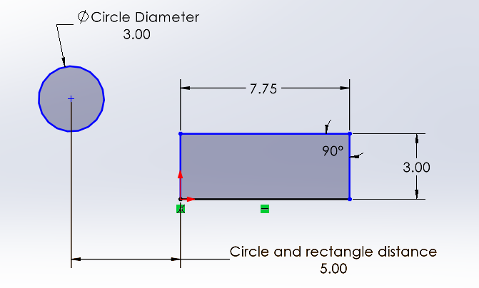

You can also add text to the dimension. By selecting the dimension and going to the sidebar, you can edit the section that says dimension text. Here you can add descriptions of your dimension to give other people who might view your CAD context and clarity. Remember to keep your dimensions clean and simple because when working in teams, it makes it easier for other people to understand your sketches and work with them.

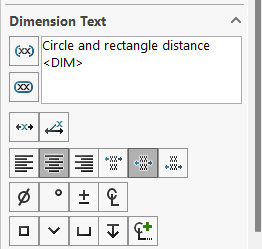

### Other Important Sketch Tools

**Offsets**

Offsets allow you to select entities and create larger or smaller versions of them by a specific amount. This can be useful for mapping out specific clearance areas around your shape, creating dependencies, or creating complex shapes easily.

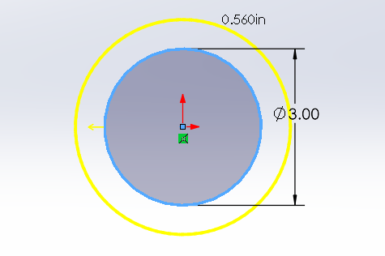

**Trim**

Trim allows you to remove specific entities to connect shapes to create complicated shapes that wouldn't otherwise be create-able. The most important type of trim is power trim, where you can just drag your cursor through lines, and it will remove the line until another point is reached which is convenient for connecting entities. 

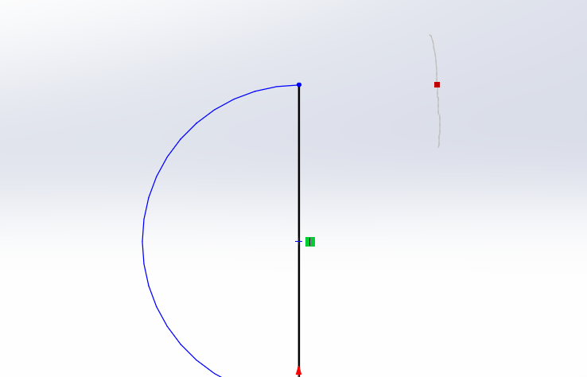

**Sketch Patterns**

Sketch patterns allow you to duplicate entities in a large amount. There are two types of sketch patterns, linear and circular.

Linear sketch patterns let you create a line of a specific entity. Once you select linear sketch pattern, select the box that says 'entities to pattern', then select the entity you want patterned. Then, you can choose your direction out of a preset x or y axis or along your own line. Then, you can set distance between entities(remember to check the box that says dimension spacing) and denote how many entities you want. 

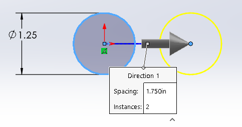

Circular sketch patterns are similar, except in a circle. Instead of selecting an axis to create your pattern around, you can select an arc, a circle, or a point for your entities to revolve around. You can also specify the number of instances and the number of degrees in between each instance. 

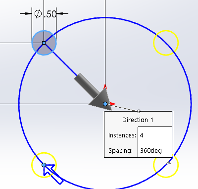

**Mirror**

Mirroring entities is a helpful way to duplicate entities quickly and save a lot of time. You simply select the entities you want to mirror, then select a line you want to mirror the entities over. 

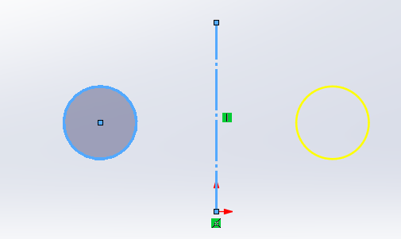

**Sketch Fillet and Chamfer**

Sketch fillets and chamfers are ways in which you can round off or chip off corners of sketches. 

Fillets replace a corner with 1/4 of a circle, which's radius you can specify. This is helpful for quickly rounding corners off instead of using arcs, and it allows you to keep the preserve the lines dimensions at more useful amounts. 

Chamfer is similar, except its like the corner gets cut off. You can specify how the corner gets cut off, with options that allow you to specify different lengths cut off or lengths cut at specific angles.

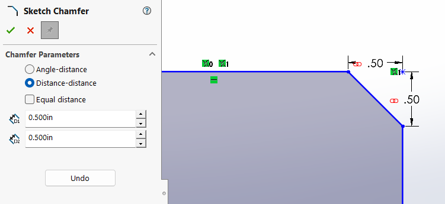

### Tips and Tricks
Although it may look like you are drawing in 3 dimensions, keep in mind that everything you draw maps onto the selected plane. 

Make sure shaded sketch contours is on, because it shades every complete shape gray which is key to completed sketches without issues.